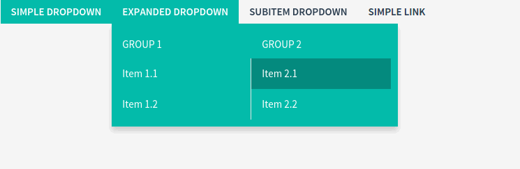

Menu
====

Animations
~~~~~~~~~~

We have included for you a :ref:`list of animations <reference-animations>` that you can use for the menu.

To apply an animation to a menu, add it as its class. For example, if we want to use ``zoomIn`` animation,
we will use a ``menu-zoomIn`` class, that we append to menu's class list like this:

.. code-block:: html

    <ul class="navbar__nav menu-zoomIn">

Source
~~~~~~

Sass styles are in the file ``template_src/src/assets/sass/layout/_navbar.sass``

Jade sources are in ``template_src/src/jade/partials/layout/navbar.jade``

Variations
~~~~~~~~~~

Realtyspace comes with 2 menu variations: the large version which is set by default and another is compact -
to enable it, add the ``compact`` class to the body tag.

Example
~~~~~~~

.. code-block:: html

    <ul class="navbar__nav">
        <li class="navbar__item dropdown active">
            <a data-toggle="dropdown" class="dropdown-toggle navbar__link">Simple Dropdown</a>
            

                <button class="navbar__back js-navbar-submenu-back">Back</button>
                

                    <ul class="navbar__subnav">
                        <li class="navbar__subitem active"><a class="navbar__sublink">Item 1</a></li>
                        <li class="navbar__subitem"><a class="navbar__sublink">Item 2</a></li>
                    </ul>
                

            

        </li>
        <li class="navbar__item dropdown">
            <a data-toggle="dropdown" class="dropdown-toggle navbar__link">Expanded Dropdown</a>
            

                <button class="navbar__back js-navbar-submenu-back">Back</button>
                

                    <h5 class="navbar__subtitle">Group 1</h5>
                    <ul class="navbar__subnav">
                        <li class="navbar__subitem"><a class="navbar__sublink">Item 1.1</a></li>
                        <li class="navbar__subitem"><a class="navbar__sublink">Item 1.2</a></li>
                    </ul>
                

                

                    <h5 class="navbar__subtitle">Group 2</h5>
                    <ul class="navbar__subnav">
                        <li class="navbar__subitem active">
                            <a class="navbar__sublink">Item 2.1</a></li>
                        <li class="navbar__subitem">
                            <a class="navbar__sublink">Item 2.2</a></li>
                    </ul>
                

            

        </li>
        <li class="navbar__item dropdown">
            <a data-toggle="dropdown" class="dropdown-toggle navbar__link">Subitem Dropdown</a>
            

                <button class="navbar__back js-navbar-submenu-back">Back</button>
                

                    <ul class="navbar__subnav">
                        <li class="navbar__subitem"><a class="navbar__sublink">Item 3</a></li>
                        <li class="navbar__subitem"><a class="navbar__sublink">Item 4</a></li>
                        <li class="navbar__subitem dropdown">
                            <a data-toggle="dropdown" class="dropdown-toggle navbar__sublink">Subitems</a>
                            

                                <ul class="navbar__subnav">
                                    <li class="navbar__subitem"><a class="navbar__sublink">Subitem 1</a></li>
                                    <li class="navbar__subitem"><a class="navbar__sublink">Subitem 2</a></li>
                                </ul>
                            

                        </li>
                    </ul>
                

            

        </li>
        <li class="navbar__item"><a class="navbar__link">Simple link</a></li>
    </ul>

Usage
~~~~~

The menu supports multilevel dropdowns. To enable this feature, add the ``dropdown`` class to ``li`` tag, which is the parent of the dropdown.
The link must have the following attributes

.. code-block:: html

    <a href="" data-toggle="dropdown" class="dropdown-toggle navbar__link">

and should be followed by a ``div`` container with the attributes

.. code-block:: html

    

Each container is required to contain a back button

.. code-block:: html

    <button class="navbar__back js-navbar-submenu-back">Back</button>

which is displayed on mobile devices.

Here is a example how to add a title for a menu group.

.. code-block:: html

    <h5 class="navbar__subtitle">Group 2</h5>

On mobile devices, the language dropdown is incorporated in the menu, therefore the class ``navbar__item--lang`` is used
in order to hide the language dropdown from menu on large displays.

Beside the already mentioned classes ``dropdown-menu navbar__dropdown``, the dropdown menu ``div`` may contain
a third set of class that specifiy the number of columns the dropdown menu can be split in.

* ``navbar__dropdown--colls-1``
* ``navbar__dropdown--colls-2``
* ``navbar__dropdown--colls-3``

The second and deeper levels must have a additional class ``navbar__submenu--level``.

Active item can be set by adding the ``active`` class.

.. Tip::

    If the top-level menu items are close to the right edge of the menu, it is a good idea to align dropdown
    by the right side/ for this add class ``navbar__dropdown--right`` .

