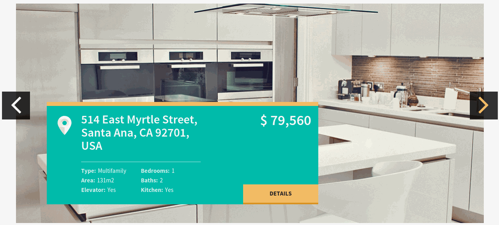
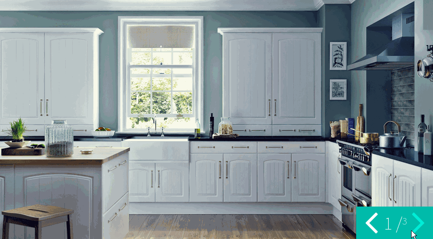

Slick Slider
============

Documentation and examples
    http://kenwheeler.github.io/slick/

Animations
~~~~~~~~~~

We have included for you a :ref:`list of animations <reference-animations>` that the Slick slider can use, to transition from one slide to another.

To apply an animation to specific slider, add it as its class. For example, if we want to use ``zoomIn`` animation,
we will use a ``slider-zoomIn`` class, that we append to slider's class list like this:

.. code-block:: html

    

        

Source
~~~~~~

Sass styles are in folder ``template_src/sass/widgets/slider.sass``

Jade source are in:

* ``template_src/jade/partials/widgets/wide_slider.jade`` - wide slider with caption
* ``template_src/jade/partials/widgets/small_slider.jade`` - small slider with counters

Js initialization are in ``assets/src/assets/js/demo.js``

* ``initWideSlider()`` - function which init wide slider
* ``initBlogSlider()`` - initilize blog's page slider
* ``initPropertyDetailsPage()`` - initilize slider on property details page

Variations
~~~~~~~~~~

There is 2 varioations of slider

* ``slider--wide`` with caption
* ``slider--small`` with counters

Options
~~~~~~~

Slider are reponsive, touchbased, and free to change. You can remove caption from wide slider, or hide arrows through sass.

Importants js configuration:

* ``autoplay`` - enable autoplay
* ``infinite`` - continuous scrolling
* ``speed`` - speed slide's change

Examples
~~~~~~~~

Wide slider
***********

.. code-block:: html

    <!-- START SLIDER-->
    

        

            

                
                

                    <a href="property_details.html" class="slider__address">
                        4011 South Sycamore Street, Santa Ana, CA 92701, USA
                    </a>
                    

                        <dl>
                            <dt>Area:</dt>
                            <dd>460m2</dd>
                            <dt>Elevator:</dt>
                            <dd>Yes</dd>
                        </dl>
                        <dl>
                            <dt>Bedrooms:</dt>
                            <dd>1</dd>
                            <dt>Baths:</dt>
                            <dd>1</dd>
                            <dt>Kitchen:</dt>
                            <dd>Yes</dd>
                        </dl>
                    

                    <!-- end of block .slider__params-->
                    <strong>$ 8780</strong>per month
                    <a href="/" class="slider__more">Details</a>
                

                <!-- end of block .slider__caption-->
            

            <!-- end of block .slider__item-->
        

        <!-- end of block .slider__block-->
        

            <button class="slider__control slider__control--prev js-banner-prev"></button>
            <button class="slider__control slider__control--next js-banner-next"></button>
        

    

    <!-- END SLIDER-->

.. code-block:: js

    var $indexBanner = $('#simple-slider');

    $indexBanner
            .find('.js-slick-slider')
            .slick({
                dots: false,
                infinite: true,
                speed: 300,
                slidesToShow: 1,
                centerMode: true,
                variableWidth: true,
                prevArrow: $indexBanner.find('.js-banner-prev'),
                nextArrow: $indexBanner.find('.js-banner-next'),
                responsive: [
                    {
                        breakpoint: 1300,
                        settings: {
                            centerMode: false,
                            variableWidth: false,
                            arrows: true
                        }
                    }
                ]
            }
    );

Small slider example
********************

.. code-block:: html

    

        

            

            

            

        

        

            <button type="button" class="slider__control slider__control--prev js-banner-prev"></button>
            1 /
            
            <button type="button" class="slider__control slider__control--next js-banner-next"></button>
        

    

.. code-block:: js

    var $simpleSlider = $('#counter-slider'),
            $simpleSliderCurrent = $simpleSlider.find('.js-properties-banner-current'),
            $simpleSliderTotal = $simpleSlider.find('.js-properties-banner-total');

    var totalItems = $simpleSlider.find('.slider__item').length;

    $simpleSliderTotal.html(totalItems);
    $simpleSlider
            .find('.js-slick-items')
            .slick({
                dots: false,
                infinite: true,
                speed: 300,
                slidesToShow: 1,
                prevArrow: $simpleSlider.find('.js-banner-prev'),
                nextArrow: $simpleSlider.find('.js-banner-next')
            }).on('afterChange', function (event, slick, currentSlide) {
                $simpleSliderCurrent.html(currentSlide + 1 + ' /');
            });

